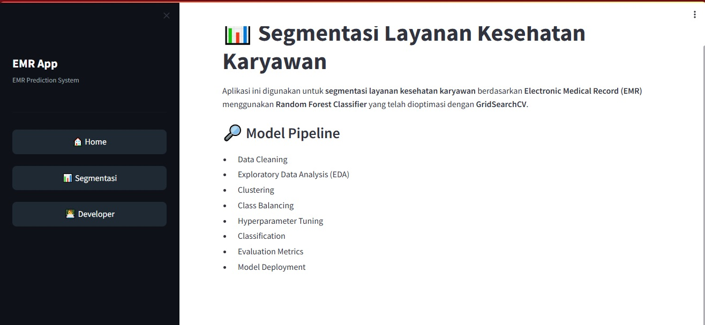
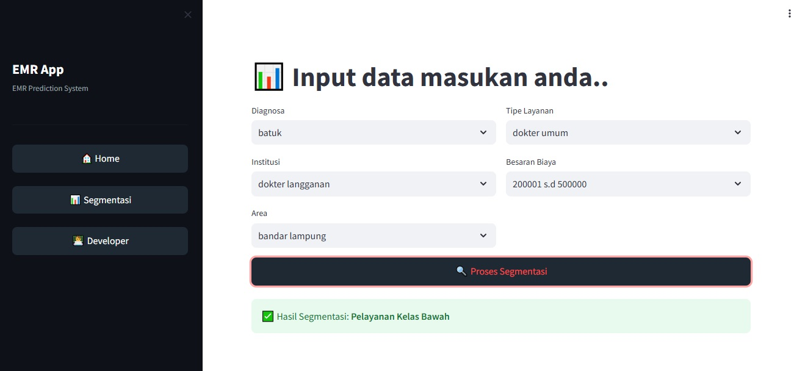
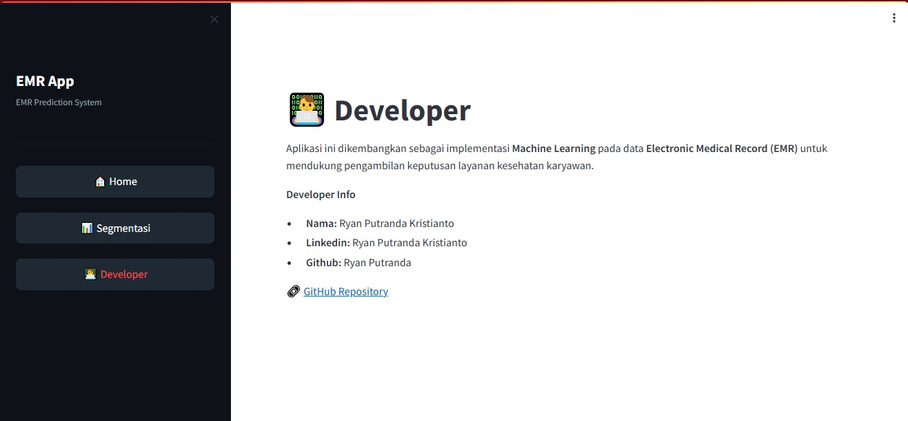

# Deploy Model EMR to Streamlit

## 📊 Aplikasi Segmentasi Layanan Kesehatan Karyawan

Aplikasi ini merupakan sistem **segmentasi layanan kesehatan karyawan**
berbasis **Electronic Medical Record (EMR)** yang dikembangkan menggunakan
**Machine Learning (Random Forest Classifier)** dan diimplementasikan dalam
bentuk **web application menggunakan Streamlit**.

Tujuan utama aplikasi ini adalah membantu proses **analisis dan pengambilan
keputusan layanan kesehatan** dengan mengelompokkan layanan ke dalam
kelas **bawah, menengah, dan atas** secara otomatis.

| Aspek | Penjelasan |
|------|-----------|
| Nama Proyek | Aplikasi Segmentasi Layanan Kesehatan Karyawan |
| Domain | Healthcare Analytics |
| Data | Electronic Medical Record (EMR) |
| Metode Machine Learning | Random Forest Classifier |
| Optimasi Model | GridSearchCV |
| Platform | Web Application |
| Framework | Streamlit |
| Bahasa Pemrograman | Python |
| Tujuan | Melakukan segmentasi layanan kesehatan karyawan berdasarkan data EMR |
| Output | Kategori layanan: kelas bawah, menengah, dan atas |

| Fitur | Deskripsi |
|------|----------|
| Home Page | Menampilkan informasi umum dan alur kerja sistem |
| EMR Predict | Form input data EMR untuk melakukan segmentasi layanan |
| Machine Learning Model | Prediksi segmentasi menggunakan Random Forest |
| Label Encoding | Transformasi data kategorikal sebelum prediksi |
| Result Visualization | Menampilkan hasil segmentasi layanan |
| About Page | Informasi pengembang dan repository |

| Tahapan | Keterangan |
|--------|------------|
| Data Cleaning | Membersihkan data EMR dari nilai tidak valid |
| Exploratory Data Analysis | Analisis awal karakteristik data |
| Clustering | Pengelompokan awal data layanan |
| Class Balancing | Menyeimbangkan distribusi kelas |
| Hyperparameter Tuning | Optimasi model menggunakan GridSearchCV |
| Classification | Klasifikasi layanan menggunakan Random Forest |
| Evaluation | Evaluasi performa model |
| Deployment | Implementasi model ke aplikasi Streamlit |

## Run: Streamlit run site.py
